# Light Game 100
100 マスワールドを 10 分で照らすミニゲームです。プレイヤースキルが要求されます。

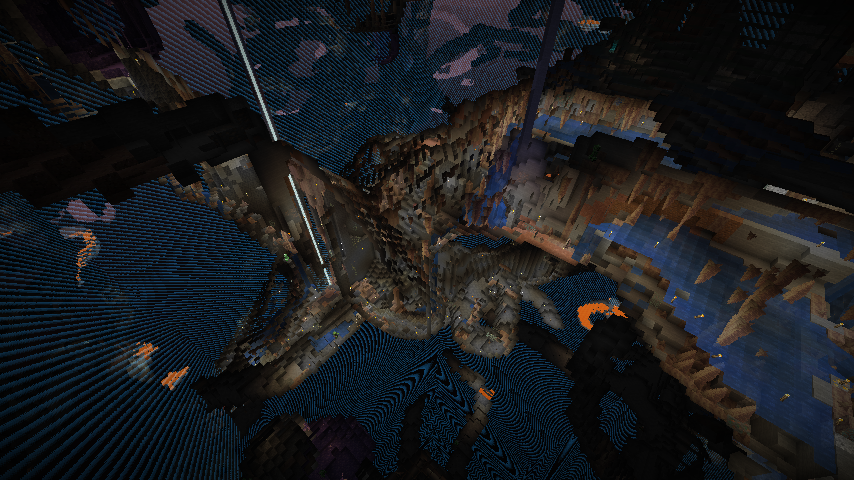

ライブ配信: 

- #1 [10分で明るくする #minecraft #マインクラフト #マイクラ - YouTube](https://www.youtube.com/watch?v=6PuuQgDVaZk)
- #2 [10分で明るくする #minecraft #マインクラフト #マイクラ - YouTube](https://www.youtube.com/watch?v=G-ifHgus08k)

MOD はこちらからアクセス:

→ <https://github.com/stakiran/lightgame100>

## 遊び方

### 1: MOD をインストール
<https://github.com/stakiran/lightgame100> に從ってください。

### 2: マイクラを起動し、クリエイティブ + ハードで開始

### 3: 初期セットアップ
`/lightgame setup` でセットアップします:

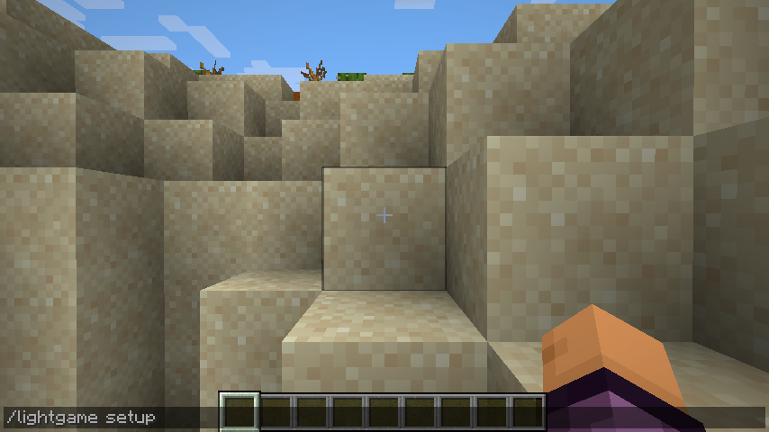

`/lightgame kit` で初期アイテムを調達します。並び順が気に入らないときは、各自変えた上でホットバーに保存してそこから呼び出す形にしてください:

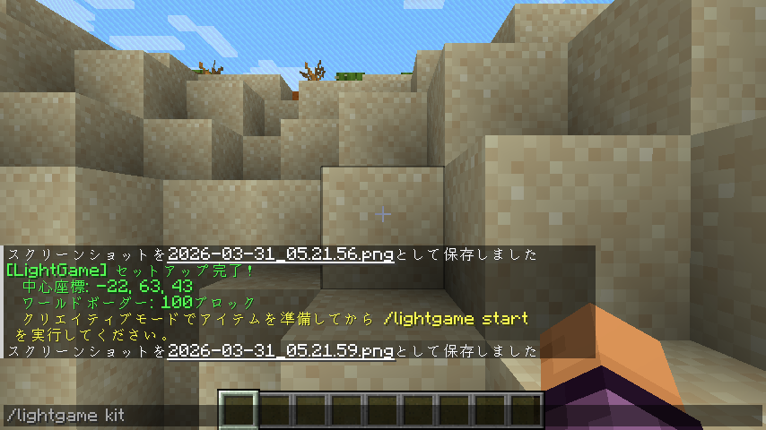

ちなみに初期アイテムは次のようになっています:

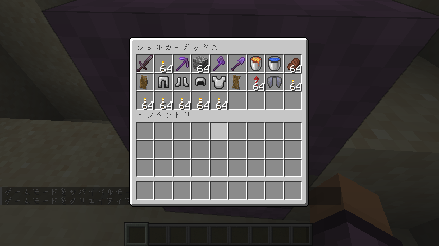

### 4: 開始
`/lightgame start` で開始します。

まずはプレビューモードとなり、30秒で地形を把握します:

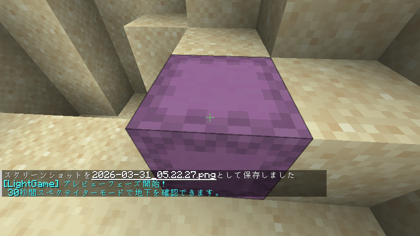 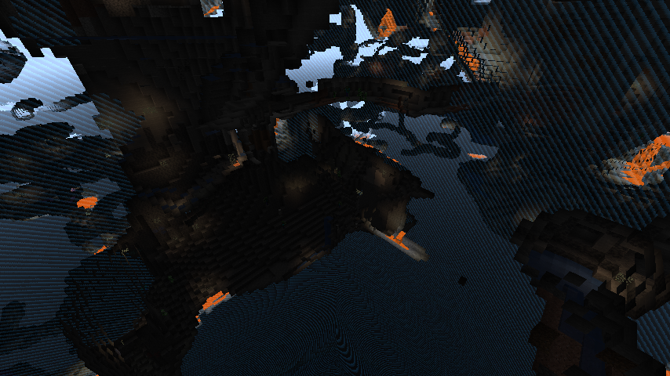 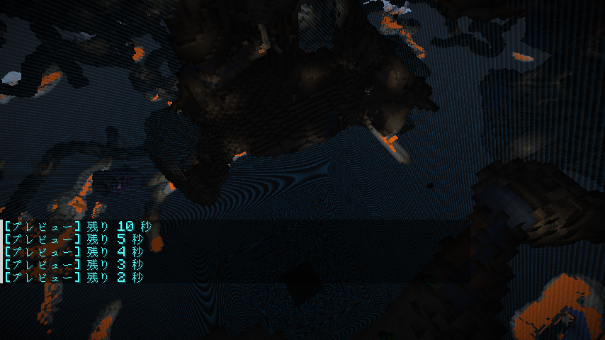

プレビューが終わったら 10 分で探索します。暗いところを松明で照らしてください！:

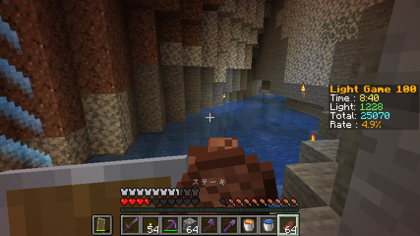

### 5: ゲーム終了
死亡するか、10分がすぎたらゲームオーバーです。

スコアを見てください:

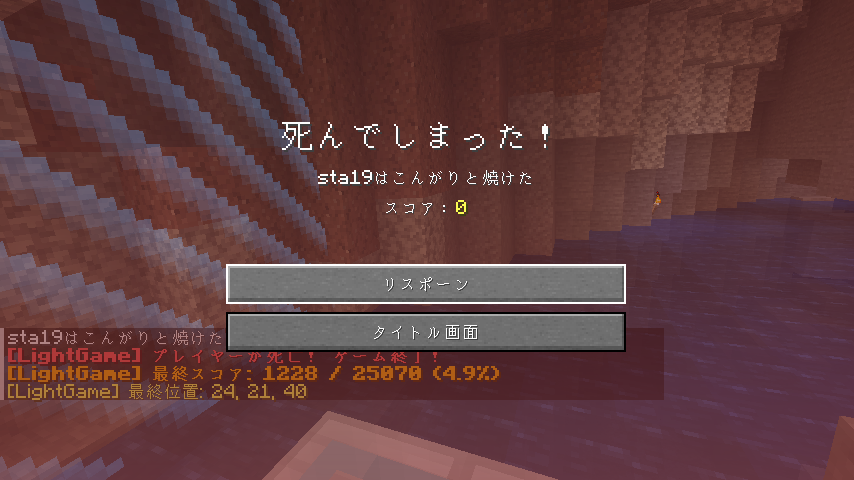

また自分がどこまで照らせたかを眺めましょう:

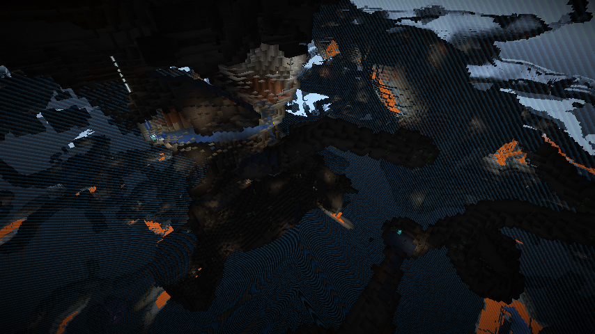

## FAQ

### Q: 途中で中断したい場合は？
Ans: 中断・再開はできません。

プレビューモード時、探索時ともに **ワールドを抜けた時点** で強制終了します。強制終了後はもう一度 setup から始めてください。

ちなみに強制終了は `/lightgame stop` コマンドでも可能です。

### Q: どんなテクニックが要求される？
Ans: 色々あります。

まずは **水バケツ着地** です。地中の洞窟に最短で行くには、通常「直下堀り」を使います。必須スキルと考えてください。

次に **多数の MOB から逃げる状況判断と移動能力** です。100 マスという狭い世界なので、MOB が密集しやすいです。物理的に戦闘では勝てないので逃げるのが基本です。以下くらいは当たり前に遭遇します:

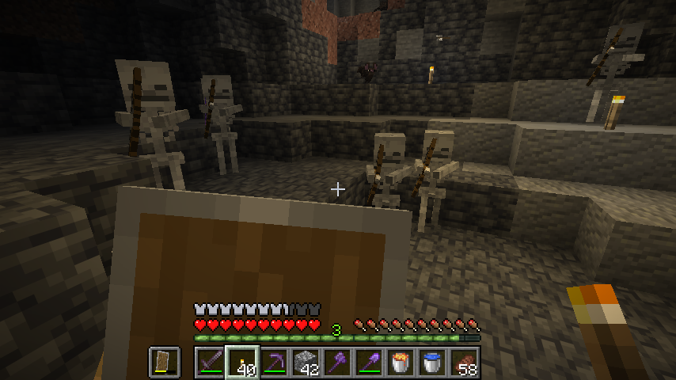 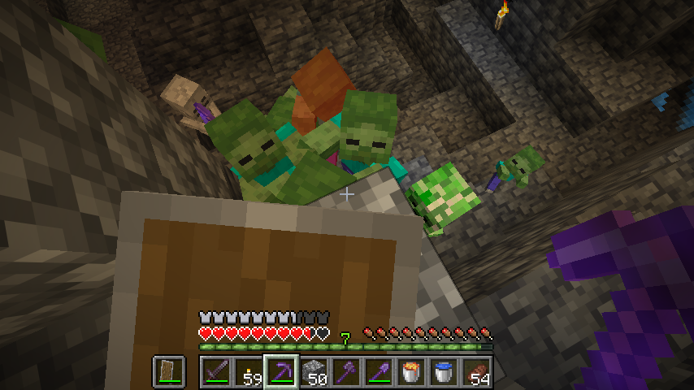 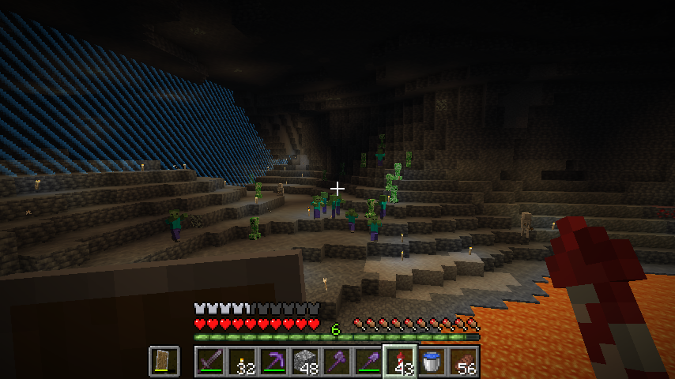

それからエリトラも必須です。直下堀りから地上に帰るときなど、移動が大変なときに重宝します。

あとはプレビュー時に見た地形を正確に覚えたり、無駄なく松明を置いたりなど、色んなテクニックやスキルが要求されます。総じてプレイヤースキルがかなり要求される遊びだと思います。

### Q: スコア目安は？
Ans: 50% 超えたら中級者を名乗れると思います。

### Q: 地形がしょっぱいときはやり直していい？
Ans: いいと思います。

私が以下のときによくやり直しますね。

- Total が 20000、30000 以下のとき（洞窟が少ない or 水が多い）
- 繁茂した洞窟のとき（どこまで照らしたかがわかりにくい）

### Q: 初期アイテムはなぜそうなっている？
Ans: ゲームバランスを保つために最適化した結果です。

- まずツール系は効率 V がついているので、採掘は早いです
- 松明は 10 分の探索が成立するが、多すぎない程度の数にしています
- 防具は裸だとさすがにキツイが、ダイヤ以上は硬すぎるので鉄フルにしています
- 盾は 2 つもあれば十分です。1 つで足りますが、たまに戦闘が激化すると壊れることがあるので 2 つです
- ブロック調達の手間をなくしたいので、丸石 1 スタックを最初から持っています
- 移動の手間が大きくなりやすいので、エリトラも持っています
- 肉は 1 スタック持っています。十分な量のはずです。10 分で消費しきることは無いと思います
- 水バケツは必須スキルなので持っています
- マグマバケツは、正直要らないかもしれません
    - 元々不要アイテムを消すために用意していましたが、10 分の探索ならアイテム整理は要らないので使いません
    - 攻撃手段としても便利です。特に MOB が密集したときに一気にダメージを与えたい場合など
    - 明るさを増やす手段としても使えるかもしれませんが、作者は今のところこの用途では使っていません（今後使う人が表れてゲームバランスが狂ったら考えようと思います）
